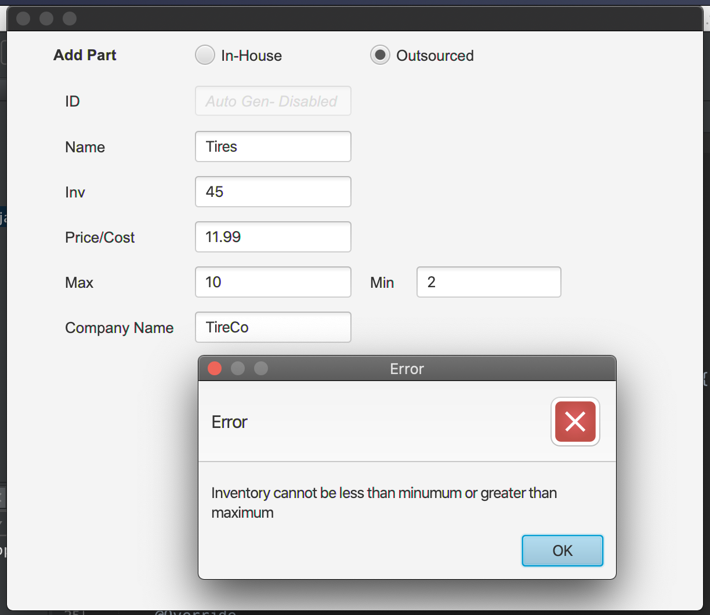
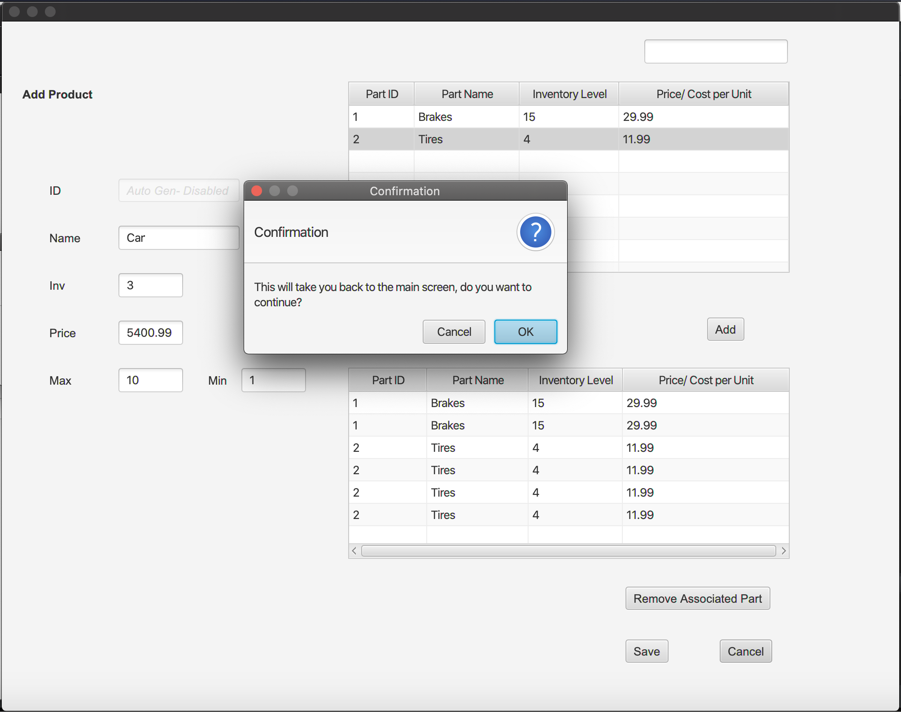
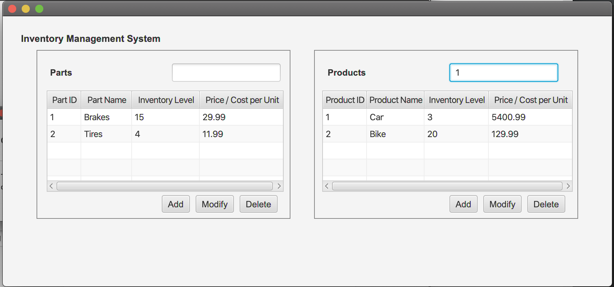
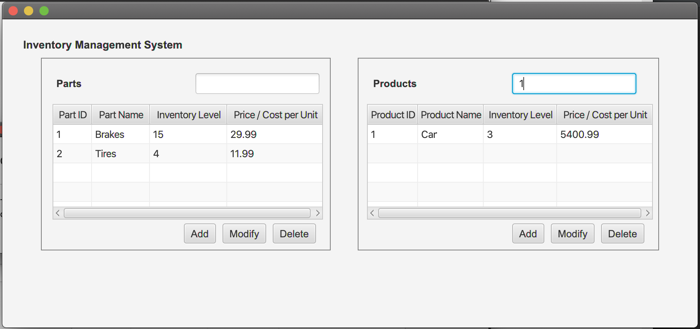
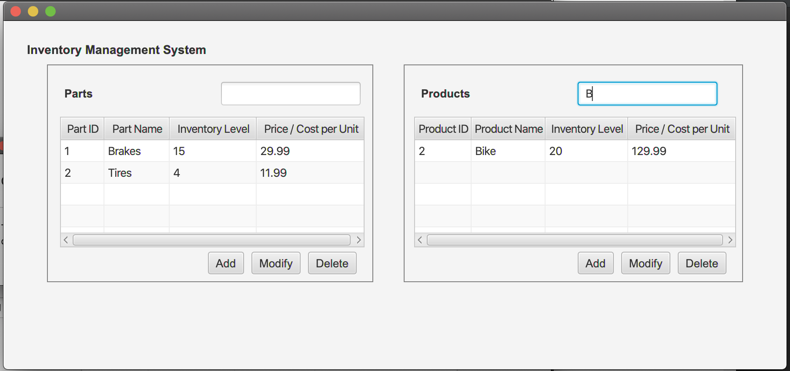
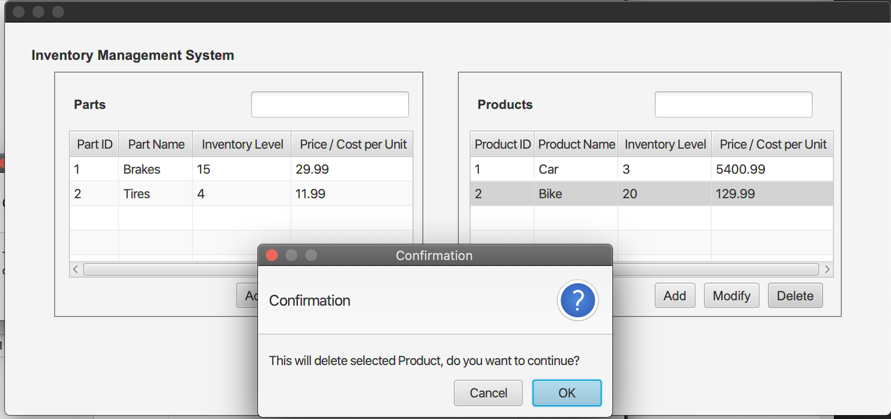
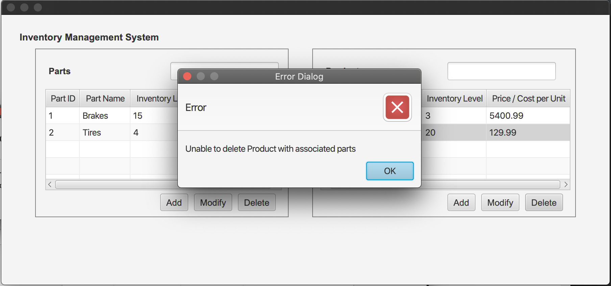

# Inventory Management System 

####  This is an inventory management system written in Java and JavaFX

This an Inventory management project that is written in an Object Oriented approach and applies the MVC design pattern for organizing the code. 

#### List of functionalities include but not limited to
*  Add of Parts and Products
* Modification of Parts and Products
* Deletion of Parts and Products
* Association of Parts to Products
* Restrictions on deleting Products with Associated Parts
* Restrictions on illegal inputs that are outside of set parameters 
* Confirmation of actions 
* Query of Part and Products by ID or Name
 
## Screenshots

